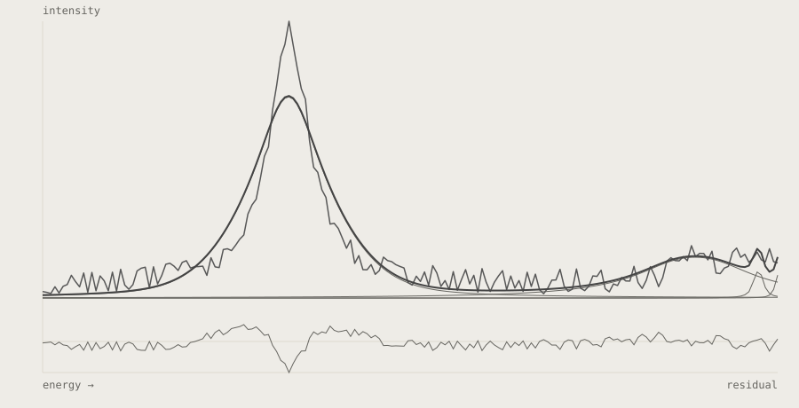
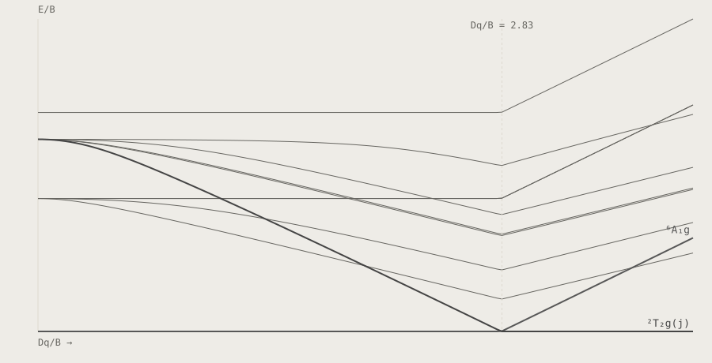

# Anselm W. Hahn

**Spectroscopy produces numbers that only become results once somebody can interpret them. Most of what is here exists because that step was harder than it needed to be.**

[ORCID](https://orcid.org/0000-0003-4543-4833) · [GitHub](https://github.com/Anselmoo)

---

## Motivation

I work on the software side of experimental chemistry: X-ray spectra of transition-metal complexes, ligand-field models, and the fitting that connects the two. The measurements are expensive and the interpretation is not automatic.

The tools here close that gap, and more recently the same question has moved to conversational ones — whether a language model can be handed a scientific instrument rather than a description of one.

## Skills

*Every capability links the artefact that admits it. There is no self-assessed level here: a bar is a claim about a person, a link is evidence.*

### Computational spectroscopy

**Spectral fitting and peak deconvolution** — Separating overlapping features in a measured spectrum into components a chemist can argue about, with the fit itself reproducible.  
Evidence: [SpectraFit](https://github.com/Anselmoo/SpectraFit) · [ACS Omega](https://doi.org/10.1021/acsomega.3c09262) · since 2024

**Ligand-field and term-symbol analysis** — Turning d-d excitation energies into a ligand-field parameter set, and the diagrams that make the assignment checkable.  
Evidence: [TanabeSugano](https://github.com/Anselmoo/TanabeSugano) · [Inorganic Chemistry](https://doi.org/10.1021/acs.inorgchem.7b00940) · since 2017

**X-ray spectroscopy of transition-metal complexes** — Reading oxidation state and electronic structure out of RIXS and X-ray emission data, including where the conventional reading fails.  
Evidence: [Angewandte Chemie](https://doi.org/10.1002/ange.202015669) · [Inorganic Chemistry](https://doi.org/10.1021/acs.inorgchem.8b01010) · since 2018

### Tools for language models

**Model Context Protocol server design** — Exposing a scientific instrument to a language model as a tool it can call, rather than as prose it has to imitate.  
Evidence: [2026](https://doi.org/10.26434/chemrxiv.15007941/v2) · [mcp-zen-of-languages](https://github.com/Anselmoo/mcp-zen-of-languages) · since 2026

**Packaging and distributing MCP servers** — Getting a server from a working repository to something a stranger can install without reading the source.  
Evidence: [mcp2mcpb](https://github.com/Anselmoo/mcp2mcpb)

**Static analysis as an agent-callable tool** — Wrapping linters and type checkers so a model gets a verdict with locations instead of an opinion.  
Evidence: [mcp-server-analyzer](https://github.com/Anselmoo/mcp-server-analyzer) · [mcp-ai-agent-guidelines](https://github.com/Anselmoo/mcp-ai-agent-guidelines)

### Research software practice

**Release engineering and repository policy** — Versioning, changelogs and branch policy enforced by a tool rather than by remembering.  
Evidence: [repo-release-tools](https://github.com/Anselmoo/repo-release-tools) · [werkstoff](https://github.com/Anselmoo/werkstoff)

**Making software citable** — Archived releases with concept DOIs, so a method section can point at the exact code that produced a figure.  
Evidence: [useful-math-functions](https://github.com/Anselmoo/useful-math-functions) · [faccts/orca-external-tools](https://github.com/faccts/orca-external-tools) · since 2025

**Optimisation and numerical methods** — Implementing and comparing optimisers where the objective is a physical model, not a benchmark function.  
Evidence: [useful-optimizer](https://github.com/Anselmoo/useful-optimizer) · [Radial Basis Function Network Fitting](https://github.com/Anselmoo/RBF_NetworkFitting) · since 2019

### Visual computing

**Plotting where the data already is** — Charts in the terminal and inside the editor, so looking at a column of numbers does not require leaving the tool holding them.  
Evidence: [bashplot](https://github.com/Anselmoo/bashplot) · [vsplot](https://github.com/Anselmoo/vsplot)

**Colour systems for reading code** — Editor themes built as a measured palette rather than a set of preferences, including the contrast the palette has to hold.  
Evidence: [Caligo](https://github.com/Anselmoo/caligo-vscode-theme) · [dracula-palette](https://github.com/Anselmoo/dracula-palette)

## Programs

### Lead case — [SpectraFit](https://github.com/Anselmoo/SpectraFit)

A measured X-ray absorption band is almost never one thing. The number a chemist wants — where each transition sits, and how much of it there is — only exists once the band has been separated into components.

SpectraFit does that separation as a tool rather than as a script: a data file in, the fitted components and the residual out. It went through peer review, which is the part that matters — the method is described somewhere a reader can check it.

The figure below is real output, not an illustration.

<picture>
  <source media="(prefers-color-scheme: dark)" srcset="assets/figures/spectrafit-deconvolution-dark.svg">
  
</picture>

*Four overlapping pseudo-Voigt components resolved from one measured band. The residual strip underneath is the part the model does not explain — it is shown because a fit without it is a picture, not a result. — SpectraFit 1.5.2 · examples/example_3 · BSD-3-Clause, Anselm Hahn*

`557` PyPI downloads per month · 4th of 8 in this unit · [PyPI](https://pypi.org/project/spectrafit/)

Source: pypistats.org, last week 170, as of 2026-09-10 Series: pypistats.org, as of 2026-09-12 Concept DOI: [10.1021/acsomega.3c09262](https://doi.org/10.1021/acsomega.3c09262)

### Scientific Software

*Whoever arrives from a DOI and is looking for the software behind the figure.*

<picture>
  <source media="(prefers-color-scheme: dark)" srcset="assets/figures/tanabesugano-d5-dark.svg">
  
</picture>

*d⁵ term energies against field strength. Every excited term is a quartet or a doublet above a sextet ground state, so every d–d transition here is spin-forbidden — which is why manganese(II) salts are almost colourless. The two highlighted terms are the pair that swaps at the spin crossover. — TanabeSugano 2.0.0 · d5, B=860 cm⁻¹, C=3850 cm⁻¹ · MIT, Anselm Hahn*

**[SpectraFit](https://github.com/Anselmoo/SpectraFit)** — Spectral data fitting, grown from a personal script into peer-reviewed software.  
`557` PyPI downloads per month · 4th of 8 in this unit · [PyPI](https://pypi.org/project/spectrafit/) `90` days, PyPI downloads per day, to 2026-09-11  
Source: pypistats.org, last week 170, as of 2026-09-10 Series: pypistats.org, as of 2026-09-12 Concept DOI: [10.1021/acsomega.3c09262](https://doi.org/10.1021/acsomega.3c09262)

**[TanabeSugano](https://github.com/Anselmoo/TanabeSugano)** — Solver for Tanabe-Sugano and energy-correlation diagrams, with its own software DOI.  
`1082` PyPI downloads per month · 2nd of 8 in this unit · [PyPI](https://pypi.org/project/tanabesugano/) `347` Zenodo downloads total `90` days, PyPI downloads per day, to 2026-09-10  
Source: pypistats.org, last week 143, as of 2026-09-10 Source, Zenodo: zenodo.org, 1189 views, latest version 10.5281/zenodo.22070277, as of 2026-09-10 Series: pypistats.org, as of 2026-09-12 Concept DOI: [10.5281/zenodo.3402463](https://doi.org/10.5281/zenodo.3402463)

**[moplots](https://github.com/Anselmoo/moplots)** — Molecular-orbital plots as a series for ORCA.  
`13` PyPI downloads per month · 8th of 8 in this unit · [PyPI](https://pypi.org/project/moplots/) `90` days, PyPI downloads per day, to 2026-09-10  
Source: pypistats.org, last week 1, as of 2026-09-10 Series: pypistats.org, as of 2026-09-12

Ordering: SpectraFit stands first even though TanabeSugano is pulled more often (1082 against 557). That is the editorial exception and not an oversight: SpectraFit is the only project with a peer-reviewed article and carries the arc from personal script to citable software. Whoever arrives from a DOI is looking for exactly that arc.

### Tools for Agents and Development

*Whoever arrives from npm or a toolchain and wants the source.*

**[mcp2mcpb](https://github.com/Anselmoo/mcp2mcpb)** — Turns MCP servers published on PyPI and npm into bundles that install in Claude Desktop with one click.  
`229` PyPI downloads per month · 6th of 8 in this unit · [PyPI](https://pypi.org/project/mcp2mcpb/) `90` days, PyPI downloads per day, to 2026-09-11  
Source: pypistats.org, last week 25, as of 2026-09-10 Series: pypistats.org, as of 2026-09-12 Listed: [GitHub Marketplace](https://github.com/marketplace/actions/build-mcpb-bundle) — Action — Build .mcpb bundle · The Marketplace lists the action under its own name, not the repo name. Whoever searches for mcp2mcpb will not find it. · as of 2026-09-10

**[mcp-ai-agent-guidelines](https://github.com/Anselmoo/mcp-ai-agent-guidelines)** — MCP server with tools for hierarchical prompting, code hygiene and planning.  
`5862` npm downloads per month · [npm](https://www.npmjs.com/package/mcp-ai-agent-guidelines) `90` days, npm downloads per day, to 2026-09-11  
Source: api.npmjs.org, 2026-08-11 to 2026-09-09, as of 2026-09-10 Series: api.npmjs.org, as of 2026-09-12

**[repo-release-tools](https://github.com/Anselmoo/repo-release-tools)** — Keeps versioning, commits and changelogs boring across four ecosystems.  
`2230` PyPI downloads per month · 1st of 8 in this unit · [PyPI](https://pypi.org/project/repo-release-tools/) `90` days, PyPI downloads per day, to 2026-09-11  
Source: pypistats.org, last week 735, as of 2026-09-10 Series: pypistats.org, as of 2026-09-12 Listed: [GitHub Marketplace](https://github.com/marketplace/actions/repo-release-tools-policy-checks) — Action — repo-release-tools policy checks · as of 2026-09-10

**[mcp-server-analyzer](https://github.com/Anselmoo/mcp-server-analyzer)** — MCP server for Python analysis with Ruff and Vulture.  
`863` PyPI downloads per month · 3rd of 8 in this unit · [PyPI](https://pypi.org/project/mcp-server-analyzer/) `90` days, PyPI downloads per day, to 2026-09-11  
Source: pypistats.org, last week 152, as of 2026-09-10 Series: pypistats.org, as of 2026-09-12 Listed: [MCP Market](https://mcpmarket.com/server/analyzer) — Developer Tools, Security & Testing · Third-party curated. The page contradicts its own numbers (the header names 11 stars, the generated feature list 0) — the evidence is the listing, not the number. · as of 2026-09-10

**[mcp-zen-of-languages](https://github.com/Anselmoo/mcp-zen-of-languages)** — Architecture and idiom analysis across multiple languages, as an MCP server and CLI.  
`337` PyPI downloads per month · 5th of 8 in this unit · [PyPI](https://pypi.org/project/mcp-zen-of-languages/) `90` days, PyPI downloads per day, to 2026-09-11  
Source: pypistats.org, last week 149, as of 2026-09-10 Series: pypistats.org, as of 2026-09-12

**[werkstoff](https://github.com/Anselmoo/werkstoff)** — Workshop for original Claude Code plugins: self-assess, compass, cupertino, andon.

Ordering: mcp2mcpb stands first as flagship, even though mcp-ai-agent-guidelines shows markedly more usage — see its own usage figure, which carries the number and the date it was measured. That is the editorial exception, and it has a reason: mcp2mcpb closes a gap instead of solving a task — it connects the existing PyPI and npm ecosystem to one-click installation in Claude Desktop, in both directions, and for that it is listed as an action on the GitHub Marketplace. What follows after it is ordered by measured usage.

### Display and Terminal

*Whoever wants to see in twenty seconds whether someone here puts care into what's visible.*

**[vsplot](https://github.com/Anselmoo/vsplot)** — Plot and display data in VS Code.  
`588` installs · 1st of 2 in this unit · [Marketplace](https://marketplace.visualstudio.com/items?itemName=AnselmHahn.vsplot)  
Source: VS Marketplace, 581 downloads total, as of 2026-09-10 Listed: [Visual Studio Marketplace](https://marketplace.visualstudio.com/items?itemName=anselmhahn.vsplot) — Extension, canonical identifier AnselmHahn.vsplot · The URL carries the identifier lowercase, the API returns it capitalized. AnselmHahn.vsplot is authoritative. · as of 2026-09-10

**[Caligo](https://github.com/Anselmoo/caligo-vscode-theme)** — Dark VS Code theme, computed from OKLCH color science rather than chosen.  
`66` installs · 2nd of 2 in this unit · [Marketplace](https://marketplace.visualstudio.com/items?itemName=AnselmHahn.caligo-vscode-theme)  
Source: VS Marketplace, 502 downloads total, as of 2026-09-10

**[bashplot](https://github.com/Anselmoo/bashplot)** — Plot data instantly in the terminal, without ever leaving it.  
`35` PyPI downloads per month · 7th of 8 in this unit · [PyPI](https://pypi.org/project/bashplot/) `90` days, PyPI downloads per day, to 2026-09-08  
Source: pypistats.org, last week 4, as of 2026-09-10 Series: pypistats.org, as of 2026-09-12

**[dracula-palette](https://github.com/Anselmoo/dracula-palette)** — Color harmonies from a single seed hue, computed in OKLCH.

Ordering: vsplot stands first because, in the same unit, it is installed nine times as often as Caligo. My first judgment had Caligo first; the measurement disproved it.

## Work taken into other people's software

*A different kind of evidence than an own repository: not "I built something", but "others took my work into theirs".*

**[faccts/orca-external-tools](https://github.com/faccts/orca-external-tools)** — ORCA External Tools — interfaces to external programs for the quantum chemistry package ORCA.  
`co-author` 7 authors · OET v2.0.0 · 2025 Concept DOI [10.5281/zenodo.17865682](https://doi.org/10.5281/zenodo.17865682) ORCA is an established quantum chemistry package. A contribution there is evidence of a different kind than an own repo with the same star count.

## Publications

### Peer-reviewed articles

*11 works, 2016–2024.*

2024 · **Introducing SpectraFit: An Open-Source Tool for Interactive Spectral Analysis** · ACS Omega  
[10.1021/acsomega.3c09262](https://doi.org/10.1021/acsomega.3c09262) · preprint of [10.26434/chemrxiv-2023-cdrxf](https://doi.org/10.26434/chemrxiv-2023-cdrxf)

2023 · **Sulfur-Ligated \[2Fe-2C\] Clusters as Synthetic Model Systems for Nitrogenase** · Inorganic Chemistry  
[10.1021/acs.inorgchem.2c03693](https://doi.org/10.1021/acs.inorgchem.2c03693)

2021 · **Probing Physical Oxidation State by Resonant X‐ray Emission Spectroscopy: Applications to Iron Model Complexes and Nitrogenase** · Angewandte Chemie  
[10.1002/ange.202015669](https://doi.org/10.1002/ange.202015669)

2019 · **Elucidation of Structure–Activity Correlations in a Nickel Manganese Oxide Oxygen Evolution Reaction Catalyst by Operando Ni L-Edge X-ray Absorption Spectroscopy and 2p3d Resonant Inelastic X-ray Scattering** · ACS Applied Materials &amp; Interfaces  
[10.1021/acsami.9b06752](https://doi.org/10.1021/acsami.9b06752)

2019 · **From Ylides to Doubly Yldiide-Bridged Iron(II) High Spin Dimers via Self-Protolysis** · Inorganic Chemistry  
[10.1021/acs.inorgchem.9b01086](https://doi.org/10.1021/acs.inorgchem.9b01086)

2019 · **Spectroscopic and Quantum Chemical Investigation of Benzene-1,2-dithiolate-Coordinated Diiron Complexes with Relevance to Dinitrogen Activation** · Inorganic Chemistry  
[10.1021/acs.inorgchem.9b00177](https://doi.org/10.1021/acs.inorgchem.9b00177)

2018 · **Electronic Spectra of Iron–Sulfur Complexes Measured by 2p3d RIXS Spectroscopy** · Inorganic Chemistry  
[10.1021/acs.inorgchem.8b01010](https://doi.org/10.1021/acs.inorgchem.8b01010)

2018 · **Probing the Valence Electronic Structure of Low-Spin Ferrous and Ferric Complexes Using 2p3d Resonant Inelastic X-ray Scattering (RIXS)** · Inorganic Chemistry  
[10.1021/acs.inorgchem.8b01550](https://doi.org/10.1021/acs.inorgchem.8b01550)

2017 · **Measurement of the Ligand Field Spectra of Ferrous and Ferric Iron Chlorides Using 2p3d RIXS** · Inorganic Chemistry  
[10.1021/acs.inorgchem.7b00940](https://doi.org/10.1021/acs.inorgchem.7b00940)

2016 · **Measuring Spin-Allowed and Spin-Forbidden d–d Excitations in Vanadium Complexes with 2p3d Resonant Inelastic X-ray Scattering** · Inorganic Chemistry  
[10.1021/acs.inorgchem.6b02053](https://doi.org/10.1021/acs.inorgchem.6b02053)

2016 · **X-ray Absorption and Emission Spectroscopic Studies of \[L2Fe2S2\]n Model Complexes: Implications for the Experimental Evaluation of Redox States in Iron–Sulfur Clusters** · Inorganic Chemistry  
[10.1021/acs.inorgchem.6b00295](https://doi.org/10.1021/acs.inorgchem.6b00295)

### Preprints and software

*2 works, 2026.*

2026 · **From Black Box to Dialogue: An MCP Server for Tanabe–Sugano Diagrams as a Reference Case for Conversational Scientific Tools**  
[10.26434/chemrxiv.15007941/v2](https://doi.org/10.26434/chemrxiv.15007941/v2)

**TanabeSugano**  
[10.5281/zenodo.22062396](https://doi.org/10.5281/zenodo.22062396)

13 works, ORCID snapshot of 2026-09-11.

Further software with a DOI (6)

useful-math-functions is, at 105 downloads, the most-downloaded Zenodo record of the whole body of work — and neither the repo nor the model knew this before the concept DOIs were resolved.

**[useful-math-functions](https://github.com/Anselmoo/useful-math-functions)** — 2026  
`105` total Zenodo downloads · 299 views, zenodo.org, as of 2026-09-10 Concept DOI [10.5281/zenodo.8373434](https://doi.org/10.5281/zenodo.8373434)

**[Dataset of code metrics](https://github.com/Anselmoo/bibtex2cff)** — 2023  
`44` total Zenodo downloads · 244 views, zenodo.org, as of 2026-09-10 Concept DOI [10.5281/zenodo.7979014](https://doi.org/10.5281/zenodo.7979014)

**[Radial Basis Function Network Fitting](https://github.com/Anselmoo/RBF_NetworkFitting)** — 2019  
`33` total Zenodo downloads · 116 views, zenodo.org, as of 2026-09-10 Concept DOI [10.5281/zenodo.3418128](https://doi.org/10.5281/zenodo.3418128)

**[RIXSPlot](https://github.com/Anselmoo/RIXSPlot)** — 2019  
`33` total Zenodo downloads · 100 views, zenodo.org, as of 2026-09-10 Concept DOI [10.5281/zenodo.3407421](https://doi.org/10.5281/zenodo.3407421)

**[CSV-First-Insight](https://github.com/Anselmoo/csv_first_insight)** — 2019  
`21` total Zenodo downloads · 69 views, zenodo.org, as of 2026-09-10 Concept DOI [10.5281/zenodo.3405446](https://doi.org/10.5281/zenodo.3405446)

**[useful-optimizer](https://github.com/Anselmoo/useful-optimizer)** — 2024  
`19` total Zenodo downloads · 101 views, zenodo.org, as of 2026-09-10 Concept DOI [10.5281/zenodo.13294276](https://doi.org/10.5281/zenodo.13294276)

---

Generated by: _scripts/derive-tokens.mjs · Bands: light, dark · Contrast targets: secondary 7:1, tertiary 4.5:1 · All targets met: yes · Typeface: Inter / JetBrains Mono · Radius: 28px · Measure: 34em · Page margin: undefined · Mark: the bend, decided 2026-09-11 — 50.00 % ink, 0.000 % self-inversion · Motion: 120ms quick / 240ms considered, one curve · Generated by: _scripts/build-readme.mjs from content/
